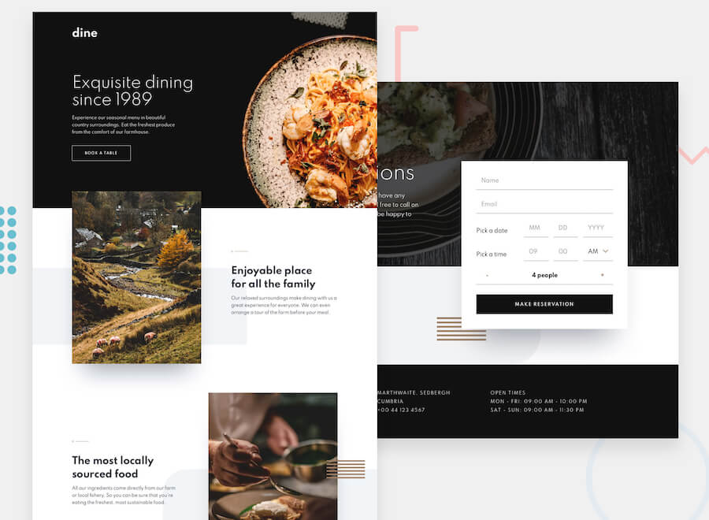

# Frontend Mentor - Dine Website Challenge



# Installation : 
Clonez le projet :
```
$ git clone https://github.com/SarahHenriette/dine-restaurant-website.git
```

Allez au repo cloné :
```
$ cd dine-restaurant-website
```

Installez les packages npm (décrits dans `package.json`) :
```
$ npm install
```

Lancez l'application :
```
$ npm run serve
```

Puis allez à l'adresse : `http://127.0.0.1:8080/`

# Démo 
https://dine-restaurant-website-one.vercel.app/